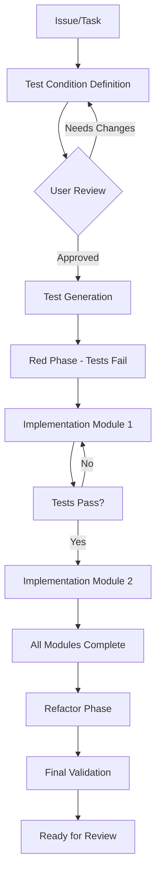

# TDD Implementation Workflow

## Overview

The TDD implementation workflow orchestrates a strict Test-Driven Development process through three specialized agents:

1. **Test Condition Architect** - Collaborates with you to define test requirements in plain language
2. **Test Builder** - Transforms requirements into executable test suites
3. **Implementation Specialist** - Writes minimal code to make tests pass, module by module

## Workflow Architecture



## Integration with Development Lifecycle

### 1. Planning Phase (`/plan:refine-issue`)
- Collaboratively explore and refine requirements
- Make architectural decisions
- Create ADRs for significant choices
- Output: Clear requirements and approach

### 2. Implementation Phase (`/implement:tdd-implement`)
**← THIS WORKFLOW**
- Transform requirements into test conditions
- Generate comprehensive test suite
- Implement code to pass tests
- Refactor for quality
- Output: Fully tested, working code

### 3. Review Phase (`/review:pr-review`)
- Comprehensive code review
- Architecture compliance check
- Test coverage validation
- Pattern Stack integration opportunities
- Output: Validated, production-ready code

## Key Principles

### Strict TDD Cycle
1. **Red**: Write tests that fail (no implementation yet)
2. **Green**: Write minimal code to pass tests
3. **Refactor**: Improve code while keeping tests green

### Module-by-Module Approach
- Complete one module entirely before starting the next
- Maintain working state after each module
- Track progress granularly in TodoWrite

### Collaborative Definition
- Work WITH the user to understand requirements
- Define test conditions in GIVEN-WHEN-THEN format
- Get explicit approval before proceeding

### Quality Gates
- Every module must achieve >80% test coverage
- All tests must pass before moving forward
- Linting, type checking, and formatting must be clean
- Performance benchmarks must be acceptable

## Command Usage

### Basic Usage
```bash
# Implement a specific issue
claude-code /implement:tdd-implement CLI-8

# Implement current work (auto-detects from git/Linear)
claude-code /implement:tdd-implement
```

### Workflow Progression
1. **Start**: Command identifies the task from Linear or git
2. **Collaborate**: Work with user to define test conditions
3. **Generate**: Create comprehensive test suite
4. **Implement**: Build features module by module
5. **Refactor**: Optimize while maintaining green tests
6. **Complete**: Prepare for review phase

## Agent Orchestration

The workflow uses parallel agent execution where beneficial:

### Sequential Phases
- Test condition definition (needs user collaboration)
- Test generation (depends on conditions)
- Module implementation (one at a time for clarity)

### Parallel Execution
- Final validation (lint, typecheck, tests, security)
- Refactoring analysis across modules
- Documentation updates

## Output Artifacts

### Test Specifications
- `tests/test_specs/[issue-id]-test-specification.md`
- Documents all test conditions and acceptance criteria

### Test Suite
- Comprehensive tests following project patterns
- Organized by module/component
- Includes unit, integration, and performance tests

### Implementation
- Minimal code that passes all tests
- Follows project architectural patterns
- Properly typed and documented

### Documentation
- Updated CLAUDE.md if patterns change
- Feature documentation in docs/
- API documentation if applicable

## Success Metrics

A successful TDD implementation will have:
- ✅ 100% of defined test conditions covered
- ✅ All tests passing
- ✅ >80% code coverage
- ✅ Clean linting and type checking
- ✅ Documentation updated
- ✅ Ready for PR review

## Tips for Effective Use

1. **Be Thorough in Test Definition**: Missing test conditions lead to bugs
2. **Think Like a User**: Consider edge cases and error scenarios
3. **Work Incrementally**: Small, atomic changes are easier to debug
4. **Trust the Process**: Don't skip steps or write code before tests
5. **Communicate Continuously**: Flag concerns early, don't wait

## Related Commands

- **Before**: Use `/plan:refine-issue` to clarify requirements
- **After**: Use `/review:pr-review` to validate implementation
- **During**: Track progress with TodoWrite tool

## Future Enhancements

As this workflow matures, we plan to:
- Add specialized agents for specific domains (API, UI, CLI)
- Integrate performance profiling into the cycle
- Add mutation testing for test quality validation
- Create domain-specific test generators
- Add automatic test data generation